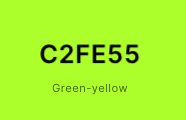
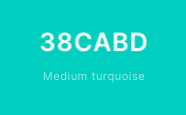
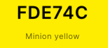
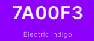
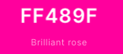

**Ping - Pong** also known as **Whiff-Whaff** is a table tennis game where two or four players hit a lightweight ball back an forth across a table divided with a net. Players use small rackets and must allow a ball played toward them to bounce one time on their side of the table. They must hit it back to the opposite side. The point is scored when the player fails to return the ball. It seems to be an easy game, but **Ping-Pong** is considered as a fast-paced challenge and requires quick reactions. 

## Demo 
The website demo can be found [**here**](https://krisk1978.github.io/play-whiff-whaff-game/).
## UX

### Project goal 
The main purpose for creating this website was to deliver a game which will be fun to play at every age. This could be a demanding task nowadays, especially
when we have an unlimited access to the digital world of sophisticated  and graphically involved games. Although *Whiff-Whaff* can be considered as very basic 
and not complicated, however, it does not mean that simplicity can boring. Playing this game demands swift reactions and even though it seems to be an easy task 
to do, the play itself can be a relatively competitive challenge. My main aim and foremost priority was to give the users some good time. 

### Designer's strategy
* to design a basic but enjoyable game for a wide range of users at any age;

* to apply minimal text, the website user is not overwhelmed with the content and simply not lose interest;

### Design elements
*   *background*
    * applied vidid colors to the project elements to make it *'eye-catching'*
            
        * **body**    

        
       
        * **canvas**  

        

        * **game elements (players/net/ball) - other colors used**

        

        

        

        

        
*   *fonts*
    * a single-type of font has been used to keep the text consistent through the website content

        

## User Stories 
1. User's expectations:
    * As a new visitor, I am hoping to have an easy access to website's content;
    * As a new visitor, I am expecting to find the website user-friendly and simple to navigate;
    * As a new visitor, I am expecting to find the game-rules clear and easy to understand;
    * As a new visitor, I want to connect with the website's host using the available social-media links;

## Wireframes
[**GAME**]()

## Features
1. The main section contains intro text ('Welcome to the World of Arcade Games!'). The background-color has been applied
to the body's element, to make it 'eye-catching'.

2. The canvas element has been used to build the game board and to render 2D shapes. The game board features the following elements:

* **playfield** element built using draw methods. It is divided in two fields by a net which helps to see the *player* (left side) and the *opponent* 
(computer - right side) locations;

* **players** created using one of the canvas draw methods with different colors applied, so the players can be 
easily recognised. Both player/opponent can move up and down to be able to hit the ball. Basic AI function has been added to control the 
opponent's (computer) movement. 

* **net** built using a canvas draw method with a vivid color applied to show player's and opponent's side of the playfield.

* **ball** created using a draw method which moves from one side of the playfield to another when the player or the opponent bounces it back.
The ball's speed depends on the number of hits. If the number of player's hits increases the ball's speed increments too.
The collision detection function has been used, so the ball bounces back from the wall (if hit by a player/opponent) within playfield area. 

* **score** - the number changes when the player/opponent scores a point. Different colors been used to show either player's or opponent's number of points. 

## Features to be implemented in the future

## Bugs 

## Technologies used 

## Other external support used to build the project

## Project Testing

## Deployment 

### How to run this project locally?

## Credits 

### Content

### Media

## Acknowledgements 

## Disclaimer 

Please be aware this website was created for educational purpose only.
