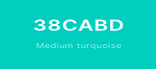

**Ping - Pong** also known as **Whiff-Whaff** is a table tennis game where two or four players hit a lightweight ball back an forth across a table divided with a net. 
Players use small rackets and must allow a ball played toward them to bounce one time on their side of the table. They must hit it back to the opposite side. 
The point is scored when the player fails to return the ball. It seems to be an easy game, but **Ping-Pong** is considered as a fast-paced challenge and requires quick reactions. 

## Demo 
The website demo can be found [**here**](https://krisk1978.github.io/play-whiff-whaff-game/).
## UX

### Project goal 
The main purpose for creating this website was to deliver a game which will be fun to play at every age. This could be a demanding task nowadays, especially
when we have an unlimited access to the digital world of sophisticated  and graphically involved games. Although *Whiff-Whaff* can be considered as very basic 
and not complicated, however, it does not mean that simplicity can boring. Playing this game demands swift reactions and even though it seems to be an easy task 
to do, the play itself can be a relatively competitive challenge. My main aim and foremost priority was to give the users some good time. 

### Designer's strategy
* to design a basic but enjoyable game for a wide range of users at any age;

* to apply minimal text, the website user is not overwhelmed with the content and simply not lose interest;

### Design elements
*   a color pallete has been used to the specific elements (body, canvas, etc.) of the project to achieve an *'eye-catching'* effect;
    
    
    
    

    

    

    

    

        
*   a single-type of font **Inconsolata** has been used to keep the text consistent through the website content, and the 
color to make it more visible;

## Wireframes
[**GAME**](https://github.com/KrisK1978/play-whiff-whaff-game/blob/master/wireframes/Game.pdf)

## Features
1. The main section contains intro text ('Welcome to the World of Arcade Games!'). The background-color has been applied
to the body's element, to make it 'eye-catching'.

2. The canvas element has been used to build the game board and to render 2D shapes. The game board features the following elements:

* **playfield** element built using draw methods. It is divided in two fields by a net which helps to see the *player* (left side) and the *opponent* 
(computer - right side) locations;

* **players** created using one of the canvas draw methods with different colors applied, so the players can be 
easily recognised. Both player/opponent can move up and down to be able to hit the ball. Basic AI function has been added to control the 
opponent's (computer) movement. 

* **net** built using a canvas draw method with a vivid color applied to show player's and opponent's side of the playfield.

* **ball** created using a draw method which moves from one side of the playfield to another when the player or the opponent bounces it back.
The ball's speed depends on the number of hits. If the number of player's hits increases the ball's speed increments too.
The collision detection function has been used, so the ball bounces back from the wall (if hit by a player/opponent) within playfield area. 

* **score** - the number changes when the player/opponent scores a point. Different colors been used to show either player's or opponent's number of points. 

## Features to be implemented in the future
1. I would like to add player's statistics by displaying the number of wins/defeats and points scored in total. This would be built into a leader's board available
once clicked on the button/tab called **Check The Leaderboard**.

## Technologies used 
I have used the following technologies to complete the project:
1. ### HTML
   
2. ### CSS 

3. ### [Bootswatch](https://bootswatch.com/)

4. ### [Font Awesome](https://fontawesome.com/)

5. ### [Google Fonts](https://fonts.google.com/)

6. ### [Favicon](https://www.favicon-generator.org/)

6. ### jQuery

7. ### Popper.js
   
## Other external support used to build the project

1. [**Am I Responsive?**](http://ami.responsivedesign.is/)

2. [**JS Hint**](https://jshint.com/)

3. [**Code Explained**](https://www.codeexplained.org/)

4. [**Find Unclosed Tags**](https://www.aliciaramirez.com/closing-tags-checker/)

5. [**Coolors**](https://coolors.co/)

6. **Unicorn Revealer**

## Project Testing
The project testing details can be found in [**TESTING.md**](https://github.com/KrisK1978/play-whiff-whaff-game/blob/master/TESTING.md) file.

## Deployment 
The project was completed using the [**Gitpod**](https://www.gitpod.io/) environment.
The website's deployment to GitHub Pages can be achieved using its [**GitHub**](https://github.com/KrisK1978/play-whiff-whaff-game)
repository and the following steps: 

* log in to [**GitHub**](https://github.com/login)

* select **play-whiff-whaff-game** from the list of **repositories**

* go to **Settingd** from the menu items located near the top of the page 

* click on a drop-down menu located under the **Source** and select **Master Branch**

*   the page is automatically refreshed and the website is deployed when **Master Branch** is selected

* you can retrieve the link to the deployed website by scrolling back down to the **GitHub Pages** section

### How to run this project locally?
You can clone the project from **GitHub** using the following process:

* follow the link to the [**repository project**](https://github.com/KrisK1978/play-whiff-whaff-game)

* use **Clone or download** button and copy the clone URL `https://github.com/KrisK1978/play-whiff-whaff-game.git`
from **Clone with HTTPs** for the repository

* go to your local **IDE** and open a new command line - terminal

* change the current working directory to the location where you want the cloned directory to be made 

* type the **git clone** command and paste the **URL** you already copied 

* click **Enter** and your local clone will be created 

You can find more information about **cloning**/**troubleshooting** using the following [**link**](https://help.github.com/en/github/creating-cloning-and-archiving-repositories/cloning-a-repository).

## Credits 

### Content
The content of the website was written by me. 

### Media
I used the following platforms to help to understand, plan, design and create part of the project.
* [**Traversy Media**](https://www.traversymedia.com/)

* [**Code Explained**](https://www.codeexplained.org/)

* [**Web Dev Simplified**](https://blog.webdevsimplified.com/)

* [**Fort Hill CSC**](https://www.forthillcsc.co.uk/)

* [**YouTube**](https://www.youtube.com/)

## Acknowledgements 
I received a motivation and inspiration for this project from my children who like to play Arcade games requiring quick decisions and 
fast-paced reactions. They asked me if I could build a simple game, so they can check their ability to make quick moves and simply to 
have some fun. 

Completing this project would not be possible without my mentor [**Simen Daehlin**](https://github.com/Eventyret). His support and advice 
was extremely helpful. I also used the [**Slack**](https://slack.com/intl/en-gb/) community channels to exchange views and experience.

## Disclaimer 

Please be aware this website was created for educational purpose only.
